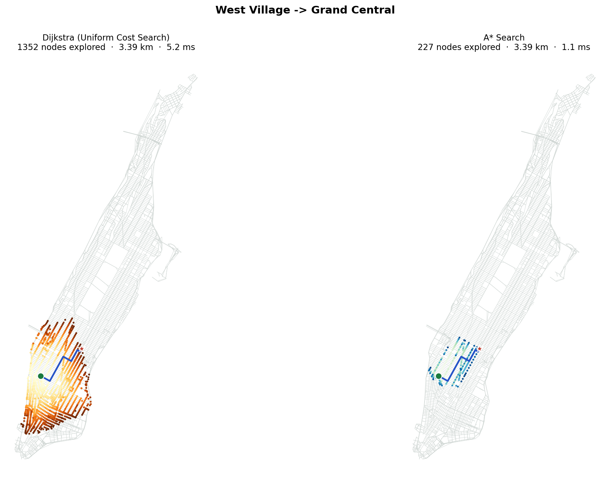

# A* vs Dijkstra: Smart Route Planner

Dijkstra and A* both find the shortest drive across Manhattan. A* just knows which way to look.

This project runs both search algorithms on Manhattan's real drivable road network from OpenStreetMap (4,634 intersections, 9,916 one-way-aware road segments), animates them node by node, and measures how much work A*'s straight-line heuristic saves.



## Results

Across 147 random trips (150 random pairs at least 300 m apart, seed 42, 3 unreachable):

| | |
|---|---|
| Fewer intersections explored by A* | **73%** on average (median 77%, best 97%, worst 24%) |
| Trips where both found the same optimal route | **147 / 147** |
| Average search time (Python) | 2.80 ms for Dijkstra vs 1.99 ms for A* (**1.4×**) |

Two findings from the batch experiment:

- **Shorter trips save more.** Under 1 km: 85%, 1–5 km: 80%, over 5 km: 69% (correlation −0.55).
- **Diagonal routes don't hurt A*.** The expected weak spot, routes cutting diagonally across the street grid, showed no real effect (correlation −0.06).

## Run it

```bash
pip install -r requirements.txt
streamlit run app.py
```

The first run downloads Manhattan's road network (about a minute) and caches it in `data/`. After that it loads instantly.

Reproduce the study and run the tests:

```bash
python -m experiments.batch_comparison
python -m unittest discover -s tests
```

## Showcase site

`site/` is a standalone static page for the project, with a live in-browser race on the same road network (a JavaScript port of both algorithms that explores exactly the same intersections as the Python version). Deploy the folder as-is to any static host, such as Netlify, Vercel or GitHub Pages.

## Project structure

```
app.py                  Streamlit app: pick places, watch both searches, compare metrics
src/algorithms/         Dijkstra, A*, heuristics and shared result types
src/graph.py            Graph representation and a synthetic grid for testing
src/graph_builder.py    Converts the OSMnx road network into that graph
src/animation.py        Node-by-node animated replay component
src/visualize.py        Static side-by-side comparison maps
experiments/            Phase 1–3 demos and the 147-trip batch experiment
tests/                  Unit tests for both algorithms
site/                   Showcase web page
```

Map data © OpenStreetMap contributors, available under the Open Database License.
